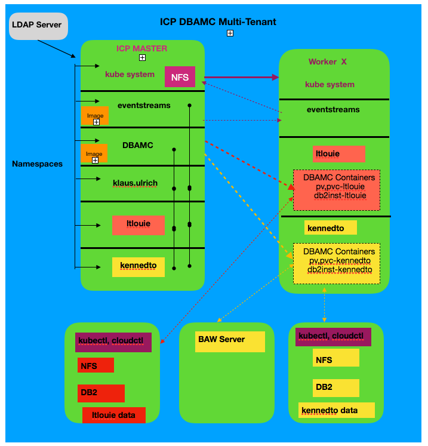
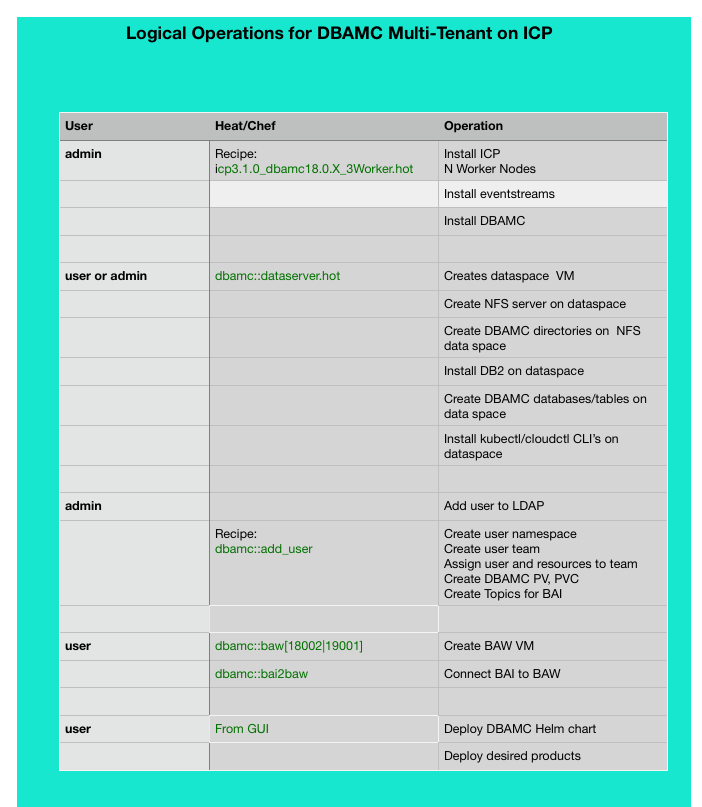

<H1>Overview</H1>

This guide describes how multiple DBAMC users may simultaneous use an ICP installation that contains a DBAMC installation.
This requires each user to work in their own namespace and leverage thier own dataspace. 
In order to accommplish this, each user: 
1) Is assigned a namespace using their notes shortname in ICP. 
2) Each user creates their own VM that contains a DB2 installation and NFS server. 

Each DBAMC product deployment is configured to work with a separate database instance and subdirectry in the NFS share.
This installation currently uses a private LDAP server, with the intention of moving to Blue Pages when appropriate.

A diagram of this is shown below.

An LDAP server is used to provide login functionality. The diagram shows ICP segregated in several namespaces: 
<UL>
<li>kube-system  - used by ICP and kubernetes</li>
<li>eventstreams - shared by users to leverage Queue operations</li>
<li>DBAMC        - shared by users to have access to DBAMC product images</li>
<li>users        - each user has their own namespace</li>
</UL>
Users  do not have visibility into the system namespace, but can see the eventstreams and DBAMC namespaces because they contain resources required for DBAMC product deployments.  Users do not have visibility into other users name spaces.

Each user has their own data server VM that they deploy themselves.  It contains an NFS server, a DB2 installation and ICP CL's preinstalled. The NFS server has appropriate directories created for DBAMC products.  The DB2 server has appropriate databases/tables created for DBAMC products.

A user can install an optional BAW server if desired.  BAW currently does not support native container deployment in ICP, so a separate Chef Recipe is used for its deployment. A script is provided to connect BAI to BAW.

Users cannot login to the master as admin or root.  They use thier LDAP user ID to login to the ICP UI.  CLI access is acheived from their data server.  The /root/icplogin.sh script is used to logon to the ICP server in their namespace.  This allows the user to use kubeclt commands to access their deployed product containers.

<H1>Setup</H1>
The steps depicted in the following table outline the operations used to setup the shared ICP/DBAMC environment.
Heat Templates are used in ACE to acheive this.  They are described below.

<h2> Deploy ICP (admin)</H2>
  The ICP administrator depoys the ICP environment from the ACE Orchesration using the 
  <code>http://aceimagerepo.rtp.raleigh.ibm.com/dbamc/icp3.1.0_dbamc18.0.X_Nworker.hot</code>
  Heat template.  An appropriate number of worker nodes should be set to meet the needs for the deployment.

<H2> Deploy User Data Server (user)</H2>
Each user must deploy their own personal data server from ACE Orchestration using the  
<code>http://aceimagerepo.rtp.raleigh.ibm.com/dbamc/dbamc_dataserver.hot</code>
Heat template. This should be done in their own personal ACE project.  The user provides the IP address of their data server to the admin so they can be added as a user to ICP.
<H2>User Request Access to ICP (user)</h2>
User request's access to the ICP environment from the ICP administator.
<H2> Admin Adds User to LDAP Server(admin)</h2>
The ICP andminstrator must add the user to the LDAP Server to allow the user to login to ICP.
<H2> Admin Adds User to ICP  (admin)</H2>
The admin will then add the user to the LDAP server by running the
<code>dbamc::add_user</code> recipe on the ICP server.  This will add a namespace for the user to ICP. The admin provides the IP address of the ICP server to the user.
<H2> User Accesses ICP and Data Server (user)</H2>
The user can login to the ICP UI using their LDAP ID. (https://[ICPIP]:8443)
The user can login to the ICP environment from a shell on their data server by running /root/icplogn.sh script.
<H2> Deploy BAW (user)</H2>
If desired, the user can run the 
<code> http://aceimagerepo.rtp.raleigh.ibm.com/dbamc/baw.hot</code> Heat template from  ACE orchestration to deploy a BAW server.
<H1>Deply DBAMC Products</H1>

<H2>Install Helms Chart</H2>
Each user must install the DBAMC Helm chart into their namespace.
 
<UL>
 <li> Login to ICP with your Notes shortname as ID.</li>
 <li> Select Catalog on top menu  </li>
 <li> Select ibm-dba-multicloud-prod chart</li>
 <li> Select Configure at the bottom right</li>
 <li> Enter shortname for Helms release</li>
 <li> Select your namespace for namespace</li>
 <li> Cick Accept License</li>
 <li> Expand all Parameters</li>
 <li>On "Repository for Docker Container Image", replace NAMESPACE(including angle brackets) token with dbamc (that is namespace where the DBAMC images are)</li>
  <li> Select Install</li>
  <li> Select View Helm release when window pops up</li>
  <li> Wait for deployment Available field to change from 0 to 1</li>
 </UL>
  
  <H2> Deploy Products</H2>

<UL>
<li> Navigate to Menu->Workloads -> Helm Releases</li> 
<li> Enter the name of your helms chart (your user name) into the filter</li>
<li> Select User Icon -> Config Client, copy Token value (look on right side --token=)
<li> Select Launch on the right hand side of your entry</li>
<li> Select Get Started</li>
</UL>

This starts the DBAMC Wizard.  It is used to deploy the DBAMC products from ICP UI.

<h3> Common Properties</h3>
<UL> 
  <li>Enter you user name for the Deployment name, select next arrow</li>
  <li>Paste token to the token field</li>
  <li>Update "Console URL" and "Master node/API server" with Master IP address</li>
  <li>Set image namespace to dbamc</li>
  <li>Set the target namespace to your namespace</li>
  <li>Enter the admin password</li>
  <li>Select next arrow</li>
  <li>Select Products to install (see below for data items for each prodcut)</li> 
</UL>

<h3> IBM FileNet Content Manager</h3>
<UL>
 <li> Expand all section to deploy and click checkbox to enable them</li>
 <li> Append your '-YOURNAMESPACE' to end of Helm Release field value </li>
</UL>

<h3> IBM Busness Automation Navagator</h3>
<UL>
  <li> Expand all Parameterssection to deploy</li>
<li> Append your '-YOURNAMESPACE' to end of Helm Release field value</li>
</UL> 
  
<h3> IBM Operational Decision Manager</h3>
<UL>
<li> Expand common settings</li>
<li> Append your '-YOURNAMESPACE' to end of Helm Release field value</li>
</UL> 

<h3> IBM Business Automation Insights</h3>
cat /root/env1 on you data server to get some of the BAI values.
<UL>
 <li> Expand all section to deploy</li>
 <li> Append your '-YOURNAMESPACE' to end of Helm Release field value</li>
  <li> Under cluster settings  
    (kafka-ibm-bai-ingress-YOURNAMESPACE,kafka-ibm-bai-egress-YOURNAMESPACE,kafka-ibm-bai-service-YOURNAMESPACE
  </li>
  <li> Under Apache Kafka:
      enter BOOTSTRAP Servers 
      Username=token 
      Password=ACCESS_TOKEN 
    CERTIFICATE=base 64 encoded 
   </li>
  <li>Unde Apache Flink 
       Storage Bucket: hdfs://ICPIP:9000/user/bai
  </li> 
  <li> Enter PVC: dbamc-bai-bai-pvc </li>
  <li>Select Next</li>
</UL> 

<h3> LDAP and Database Properies</h3>
<UL>
<li>Enter the LDAP Server hostname (RTP: 9.37.20.190, SVL: 9.30.9.79)</li>
<li>Enter LDAP Server Password (Pa88w0rd)</li>
<li>Set both ID Maps to *:cn</li>
<li>Switch to Database tab</li>
<li> Select your db2jcc4.jar file </li>
<li>For IBM Content Platform and BM Business Automation Navigator, expand each enter user data server IP and the password</li>
  <li>For ODM, Change Server name to user data server IP, set the username to db2inst1 and enter the password</li>
</UL>

<H2> UnDeploy Products</H2>
